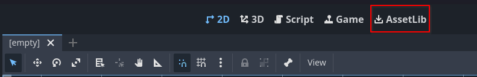
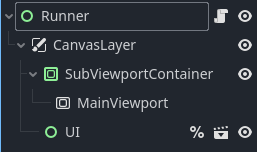
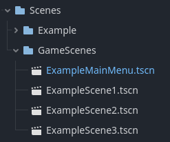
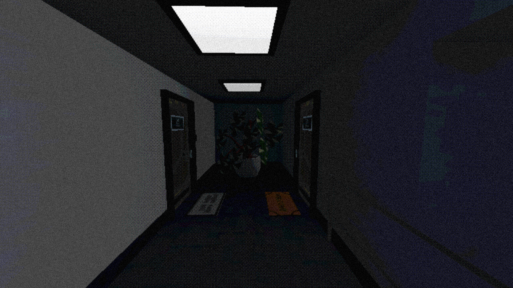
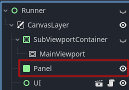
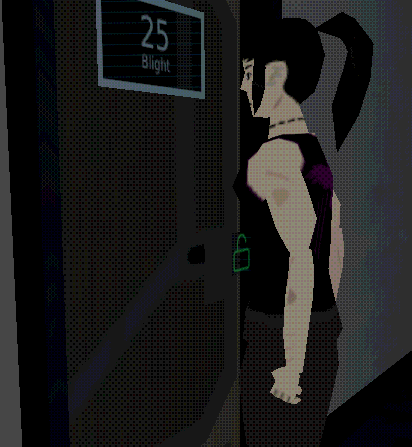
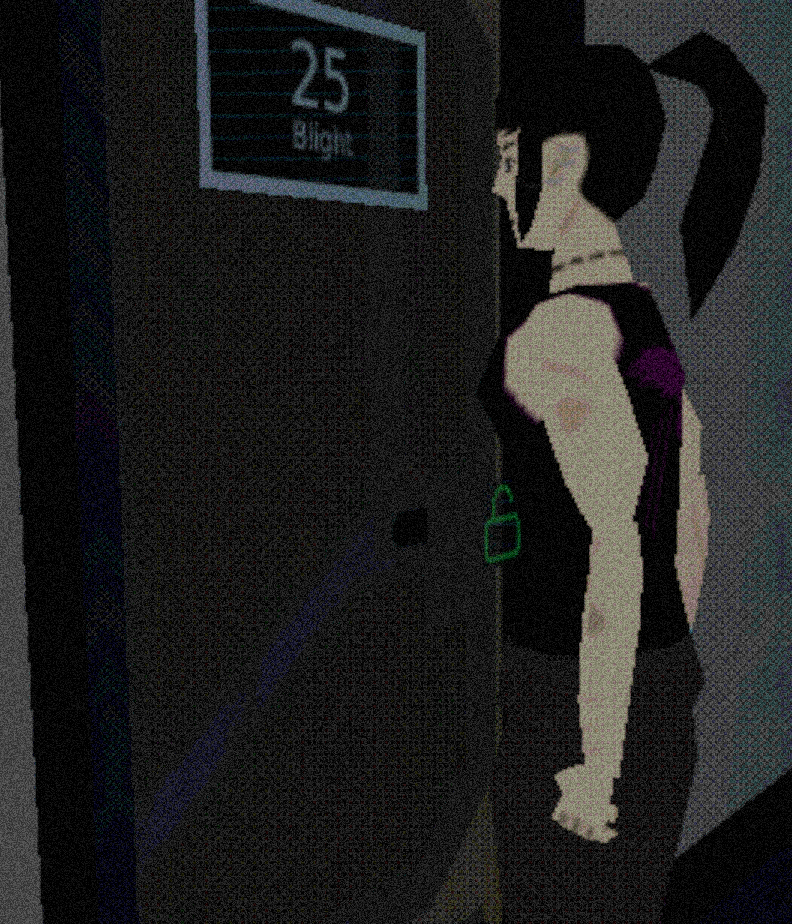

# NeonSceneRunner

A ****Godot** Plugin** that makes changing between your **Game Scenes** effortless!

- [NeonSceneRunner](#neonscenerunner)
- [Overview](#overview)
  - [What is NeonSceneRunner?](#what-is-neonscenerunner)
  - [How does it work?](#how-does-it-work)
- [Features](#features)
- [Installation](#installation)
- [Core Functionality](#core-functionality)
  - [Runner Scene Hierarchy:](#runner-scene-hierarchy)
- [Setup](#setup)
- [Usage](#usage)
- [Example Usage](#example-usage)
- [Advanced Usage](#advanced-usage)
  - [1. Screen-space Post-Processing Effects](#1-screen-space-post-processing-effects)
  - [2. Low Render Resolution](#2-low-render-resolution)

# Overview

## What is NeonSceneRunner?
NeonSceneRunner is a Godot Plugin/Addon that makes it boringly easy and straight-forward to add, remove, manage and switch between Game Scenes in your Godot Project!

Ever needed to quickly switch between levels in your game? SceneRunner is just for you!

Ever needed an easy way to reference all of your levels? SceneRunner is also for you.

Are you looking for an easy way to add Loading Screens to your game? SceneRunner will allow you to do just that!

## How does it work?

Upon running the project (with **F5** or **F6**) the **App** script instantiate a **Runner** scene. Then it moves the initial **Run Scene** (That you chose in your **Project Settings** or pressed **F6** on) into the **MainViewport** Node. The main function of this Plugin '**\_change_scene(\_scene_name)**' quickly **loads** the selected scene from the list of **Game Scenes** the user chose, shows the **Loading Screen** and **unloads** the previous one, showing the **newly instantiated Game Scene**! The script is very simple and easy to understand for those that are curious.

# Features

- Easily **store, access and reference** scenes via their name or their index.
- Quickly **switch between** scenes.
- Show **Loading Screens** in-between loading times!
- Add screen-overlay **Post-Processing Effects** that show up in **ALL** of your scenes!

# Installation

1.  In your Godot Project press the '**AssetLib**' button at the top:

2.  Search "**NeonSceneRunner**" and Download the **Plugin** and press 'Install'.
3.  Good job, you are ready to use **NeonSceneRunner**!

# Core Functionality

Firstly, let's discuss the core aspects of the **Plugin**. We have 2 **main components**:

- ***App.gd*** - An 'autoload' script (meaning it always runs on it's own, at the start of the game, regardless of the scene you run) that is responsible for creating the 'Runner', initiating it and managing references for all the other NeonAddons.
- ***Runner.tscn (SceneManager.gd)*** - It's the core scene and script that gets instantiated at the start of each Project Run. It stores the UI and the newly loaded scenes. I recommend you get familiar with the hierarchy below to understand the purpose of this scene.

## Runner Scene Hierarchy:

- **Runner** - it has the **SceneManager.gd** script which manages all things related to loading, unloading and switching between scenes. To reference it simply type ***App.\_runner***.
    - **CanvasLayer** - It's a Node that stores all UI elements which allows it to scale all of them correctly for your needs.
        - **SubViewportContainer** - A UI container for the MainViewport.
            - **MainViewport** - The one and only container for the newly loaded scenes. This is what makes all the scenes you load show up on the screen.
        - **UI** - A Node that contains all the UI you want to store and access globally (Like Loading Screens, Pause Menus, etc.)

> [!WARNING] It is very important that you DON'T CHANGE the Runner Scene AT ALL. If you wish to add any UI elements add them to the UI Scene. Never change the ordering of any Nodes, or the script will generate many errors and will not work as expected. There is one exception to this rule that will be discussed later in the Advanced Section.

# Setup

1.  Open the **Runner** scene that's located in **"res://addons/neon_scene_runner/Scenes/Runner.tscn"** and select the root 'Runner' Node.
2.  In the **Inspector** **Dock** you will see 3 values that you can modify:
    - **Game Scenes Path** - It's the path in your project that stores all the Game Scenes you want to access in your scripts. You can set it as whatever you want. The default is **'Scenes/GameScenes'**, but it can be whatever you want.
    - **Force Wait Loading** - As Godot is a very performance-friendly engine, loading scenes can be done in a blink of an eye, depending on how big the project is. Therefore to add the **illusion of the game actually loading in the scenes** and to not change scenes abruptly I've added a timer that makes the **Loading Screen** show up for X amount of time. **2.0** is the default, but it can also be set to **0.0**.
    - **Debug Mode** - In order to easily Debug the inner workings of the Plugin I've added a **Debug Mode** that prints out messages to Godot's **Output Dock**. I've **enabled** it by default, but you can easily disable it by making the property **false**.
3.  Make sure you put all of your Game Scenes in the **Game Scene Path** of your choosing (The default path is **"Scenes/GameScenes"**).
4.  Make sure that the **Run Scene** you put in **Project > Project Settings > Application > Run > Main Scene** is in the **Game Scene Path**.
5.  You are ready to use **NeonSceneRunner**!

# Usage

1.  In any of your scripts you can use the function **\_change_scene()** in order to change between scenes:
    - App.\_runner.\_change_scene("ExampleScene1")
2.  If you wish to **skip the Loading Screen** when loading in a new scene simply add a negative boolean as the second argument to the function:
    - App.\_runner.\_change_scene("ExampleScene2", false)

> [!WARNING] If you ever disable the NeonSceneRunner Plugin it will produce errors as it automatically removes the App script from Autoload. You can either comment out the usages of the _change_scene() function or change the way you access the App script (as see in the Example script):

- if ProjectSettings.has_setting("autoload/App"):  
            get_tree().root.get_node("App").\_runner.\_change_scene("ExampleScene" + str((\_example_scene_index)))

# Example Usage

Upon importing the **Plugin** you will see new Folders show up in the root of your **res:// directory**:

In order to try out the **NeonSceneRunner Addon** you can open the '**ExampleMainMenu.tscn**' Scene (or any others, if you wish) and **press** **F6** afterwards. You will be granted with an Example Title Screen for a game with a single 'Play Game' button:

&lt;screenshot&gt;

You can play around with the Example Game Scenes by pressing the buttons presented, all Scenes are color-coded to show that you are in fact switching between them.

**NeonRunner-Example-SwitchingScenes.gd Script**

You can preview the **example usage** of the **\_change_scene()** function in this script. It contains **two functions**: one for the **main 3 buttons** and one for the **Main Menu button** at the bottom, which tests the '**no loading screen**' option of the function.

# Advanced Usage

There is a couple of advanced use cases that I'd like to share:

## 1\. Screen-space Post-Processing Effects

In my game **HyperDissonance** my co-worker added a screen-space **Dithering** and **CRT** visual effects that he found on the GodotShaders website. We used the **SceneRunner** **Plugin** in order to make the shaders affect all of our **Game Scenes**. Here is how it turned out:

Here's how to add **any screen-space** PPE you'd like:

1.  Open the **Runner** Scene.
2.  Add a **Panel** **Node** and place it just before the **UI Node**, just like this:
    
3.  Set the **Panel** Node Anchor Preset to '**Full Rect'.**
4.  In the **Inspector** after selecting the **Panel** Node scroll down to the '**Material**' section.
5.  Right click the **Material** property and set it to 'New ShaderMaterial' and select the screen-space PP Effect Shader of your chosing.
6.  Done! The effect will now overlay all scenes.

## 2\. Low Render Resolution

If you want to **emulate the low render res effect** shown in many **retro video games** you can do just that! Maybe you just want to add a **Render Resolution performance setting**, you can also do that! Again, field tested on **HyperDissonance**, since the game is styled after **PS1** games we had to add a low render resolution. Here's how it looks at **1.0** (native 1080p) and **0.4** **render resolution**:

1.0 Render Scale             |  0.4 Render Scale
:-------------------------:|:-------------------------:
  |  

Here's how to easily add this effect:

1.  Open the **Runner** Scene.
2.  Select the **MainViewport Node**.
3.  Scroll down to the '**Scaling 3D**' section.
4.  Set '**Scaling 3D Scale**' to any **value** you want (Again, in **HyperDissonance** we used **0.4**).